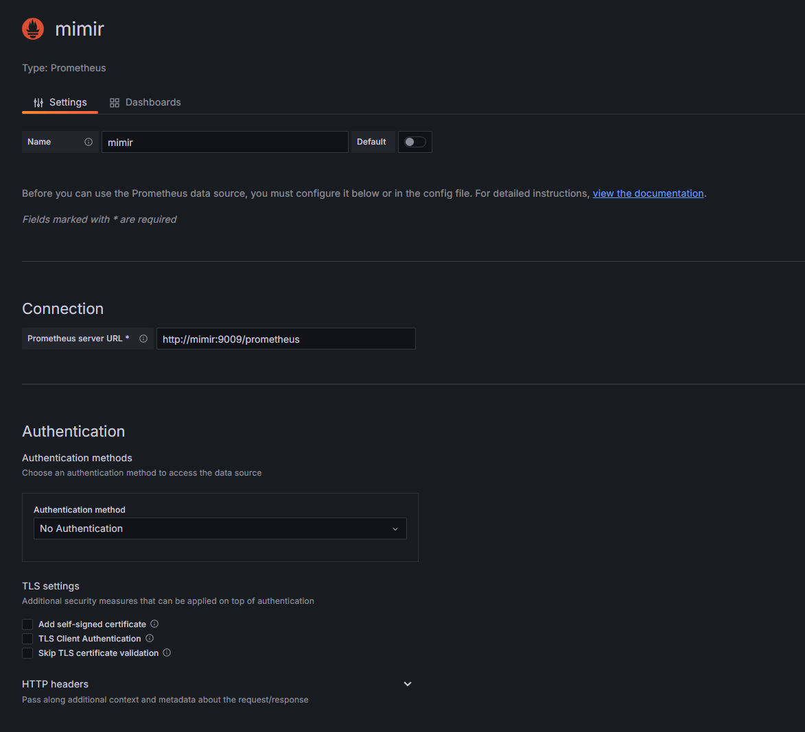

# Как пользоваться [графаной](http://localhost:3001) ?

## 1. Зайдите под дефолтными кредами (admin/admin)

## 2. Настройте датасурсы

### Добавьте следющие датасурсы:

* ### Postgres: 

* ### Loki:

* ### Tempo:

* ### Prometheus (mimir):

## 3. Переходите на [страницу дашбордов](http://localhost:3001/dashboards) и импортируйте их из папки `solution/dashboards`

## Готово! Можете пользоваться графаной и смотреть логи, трейсы, метрики и статистику по рекламе