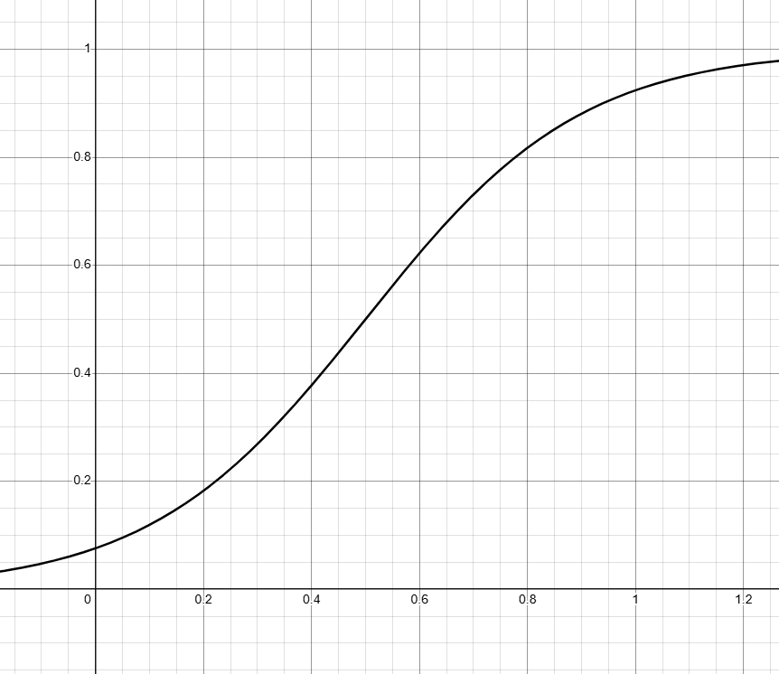
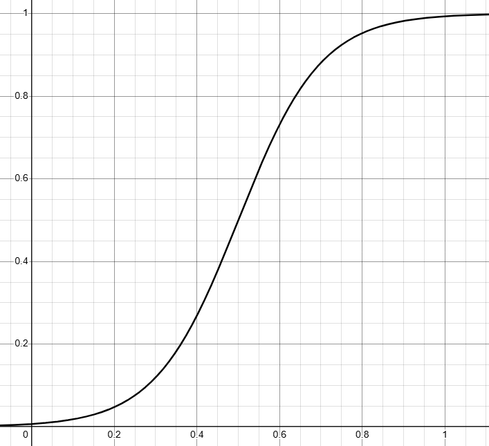

# Описание работы основных точек

В целом почти во всех эндпоинтах нет особой бизнес-логики, только базовые CRUD операции, в которых вся логика находится в SQL запросах. Но логика показа рекламы кардинально отличается.

## Сам алгоритм

* У каждого объявления есть три показателя - цена за показ (далее - CPI), за клик (далее - CPC) и ML скор (далее - релевантность).
* Метрики: прибыль платформы, релевантность, скорость работы и соответствие лимитам. Последние две метрики не зависят от идеи алгоритма и привязаны только к его технической реализации, так что их мы опустим.

## Реализация

### Математика

Далее мы будем рассматривать только идейную (математическую) реализацию алгоритма.

Если формализовать задачу: дана функция от трёх переменных, задача - максимизировать прибыль платформы, учитывая релевантность.

Для оценки каждого объявления мы подсчитываем оценку прибыли по следующей формуле:

Где

Это - логистическая кривая, выступающая в роли функции веса между ценой за показ и ценой за клик, зависящей от релевантности. Её свойства:

 

Параметр $r_{0}$ - уровень релевантности, при котором $\alpha(r) = 0.5$

Параметр $k$ (в нашем случае $10$) задает кривизну логистической кривой. Пример для $k =$ $5$ и $10$ соответственно:

 

В целом эти свойства очевидны, т.к. алгоритм строится на вероятностном подходе, где $\alpha(r)$ - вероятность клика, зависящая от релевантности ([функция распределения логистического распределения](https://ru.wikipedia.org/wiki/%D0%9B%D0%BE%D0%B3%D0%B8%D1%81%D1%82%D0%B8%D1%87%D0%B5%D1%81%D0%BA%D0%BE%D0%B5_%D1%80%D0%B0%D1%81%D0%BF%D1%80%D0%B5%D0%B4%D0%B5%D0%BB%D0%B5%D0%BD%D0%B8%D0%B5))

Тогда параметр $r_0$ будет задавать математическое ожидание, а через $k$ можно будет выразить дисперсию ($\sigma^2 = \frac{\pi^2}{3}(\frac{1}{k^2})$)

Можно было бы использовать и нормальное распределение, но считать функцию ошибок при дообучении алгоритма сложнее и дольше, чем обычную экспоненту.

Техническая реализация тривиальна - получить все доступные для показа объявления (пользователь его ещё не видел, подходит под таргетинг и так далее), посчитать значение функции выше для каждого объявления и показать то, у которого это значение наибольшее.

Но есть проблема: мы не знаем, какие параметры $r_{0}$ обозначают низкую релевантность, а какие - высокую. Тут на сцену выходит градиентный бустинг.

### Градиентный бустинг

При каждом клике/просмотре от пользователя мы записываем его в БД для последующей корректировки параметра $r_{0}$, значение которого хранится в Redis.

После каждого клика запускается функция корректировки параметра, которая высчитывает новое значение $r_{0}$ по следующей формуле:

Где:

* $r_0^{(t+1)}$ - новое значение $r_0$;
* $r_0^{(t)}$ - старое значение $r_0$;
* $\eta$ - скорость обучения (я использую $0.01$);
* $k=10$ (см. выше);
* $N$ - количество записей из БД для обучения;
* $p_i$ - значение $\alpha(r)$ при старом значении $r_0$;
* $y_i$ - истинное значение клика (0 - клиент не кликнул, 1 - кликнул).

Здесь мы батчами берём данные из базы данных для обучени, считаем градиент по $r_0$ для функции лог правдоподобия, мы берём её со знаком минус и минимизируем ([см. вывод: пролистайте до параграфа "Логистическая регрессия" и откройте коллапсив "Вывод формулы градиента"](https://education.yandex.ru/handbook/ml/article/linear-models))

После этого мы усредняем его значения градиента и умножаем скорость обучения $\eta$, выполняем градиентный спуск и получаем новое значение $r_0$.

После вычисления нового $r_0$ мы кладем его обратно в Redis.

