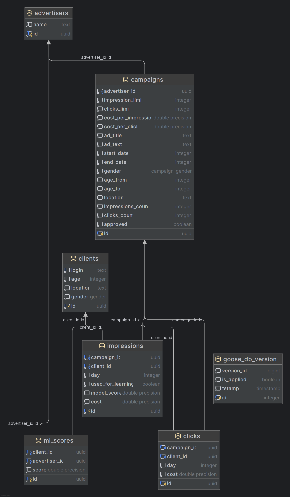

# Схема базы данных

* goose_db_version - таблица для хранения метаданных по миграциям

* clients - таблица для хранения клиентов, ничего необычного

* advertisers - таблица для хранения рекламодателей

* ml_scores - many2many таблица clients-advertisers с дополнительным полем для хранения ML скора

* campaigns - а вот тут уже интереснее. Большинство полей взяты с OpenAPI спецификации, но есть и дополнительные. impressions_count и clicks_count - поля счётчики, которые автоматически инкрементируются при помощи триггеров на PL/PgSQL на каждой уникальной вставке в таблицах impression и clicks соответственно. Поле approved используется для модерации: true - кампания одобрена, false - отклонена или ещё не рассмотрена.

* impression и clicks - many2many таблицы clients-campaigns с дополнительными полями. Day и cost используются для эндпоинтов со статистикой и при визуализации в графане. Поле used_for_learning обозначает, какие показы/клики уже использовались для обучения алгоритма показа рекламы посредством градиентного бустинга. Оно не нужно в поле clicks, т.к. показы и клики уникальны для пары пользователь-кампания, так что по этим двум ID мы можем однозначно определить, кликнул пользователь после показа или нет. 